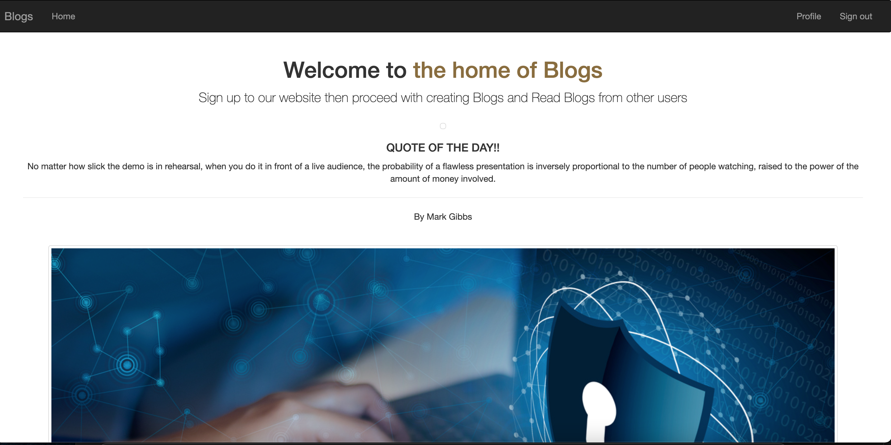
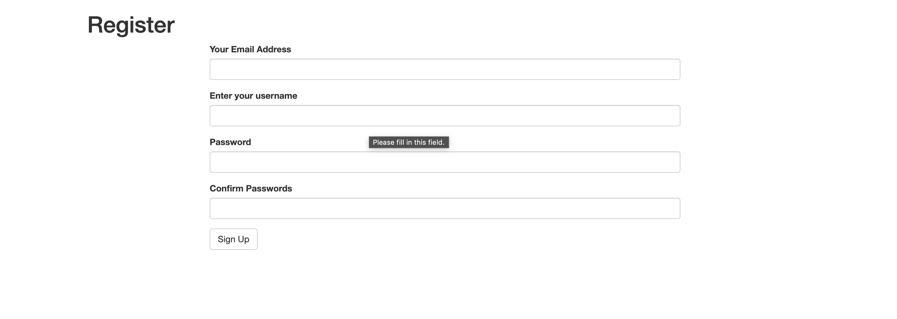
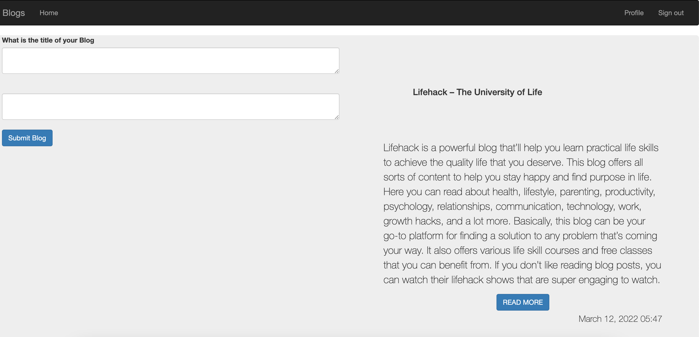

# Blog
## Project Description
A personal blogging website to create and share opinions and other users can read and comment on them. Additionally, add a feature that displays random quotes to inspire your users. 
##### By Caleb Langat
### Landing Page
On the landing page, there is a brief definition of what the application is about, buttons to redirect page visitor to the sign up and login pages. The page contains;
- Different blogs from various users
- Quotes on the landing page which changes everytime you refresh

#### Landing Page Display

### Sign-Up Page
To access blogs or create blogs, one must have an account. Page visitors are required to create their accounts from here using an e-mail address,username and password.
#### Sign-Up Page Display

### Login Page
To gain access to the system users have to identify and authenticate themselves using a username and password saved in a database through registration
#### Login Page Display

### Profile
Here a user will find everything he/she needs to create, view and a blog
#### Behavior Driven Development
- To generate a new blog, fill in the form by filling in the blog title and writing the blog text and submit when done.
- On submit, all your Blogs will be available on your profile to view and delete.
- There a button to log out the user and view all blogs on the dashboard.
#### Profile Display

#### Behavior Driven Development
* The page will ask the visitor whether he/she wishes to navigate back to the Landing page. If yes, the visitor will be redirected to the landing page and if No the user will get an alert asking him/her to close the page.

### Live link
Visit the application on https://blogs15.herokuapp.com/

### Development
#### Making modifications
To make advancements/modifications, follow these steps:
- Fork the repository
- Create a new branch (git checkout -b improve-feature)
- Make the appropriate changes in the files
- Add changes made
- Commit your changes (git commit -am 'Improve feature')
- Push to the branch (git push origin improve-feature)
- Create a Pull Request
### Technologies Used
Technologies used to develop this application:
- Python v3.9
- Flask 1.1.4
- Flask-Bootstrap
- HTML
### Support and contact details
Should you be unable to access the website, have any recommendations and/or questions, feel free to email me:[caleb.langat@student.moringaschool.com](mailto:caleb.langat@student.moringaschool.com)
### License
    ​Permission is hereby granted, free of charge, to any person obtaining a copy of this software and associated documentation files (the "Software"), to deal in the Software without restriction, including without limitation the rights to use, copy, modify, merge, publish, distribute, sublicense, and/or sell copies of the Software, and to permit persons to whom the Software is furnished to do so, subject to the following conditions:​The above copyright notice and this permission notice shall be included in all copies or substantial portions of the Software.

    ​THE SOFTWARE IS PROVIDED "AS IS", WITHOUT WARRANTY OF ANY KIND, EXPRESS OR IMPLIED, INCLUDING BUT NOT LIMITED TO THE WARRANTIES OF MERCHANTABILITY, FITNESS FOR A PARTICULAR PURPOSE AND NONINFRINGEMENT. IN NO EVENT SHALL THE AUTHORS OR COPYRIGHT HOLDERS BE LIABLE FOR ANY CLAIM, DAMAGES OR OTHER LIABILITY, WHETHER IN AN ACTION OF CONTRACT, TORT OR OTHERWISE, ARISING FROM, OUT OF OR IN CONNECTION WITH THE SOFTWARE OR THE USE OR OTHER DEALINGS IN THE SOFTWARES

Copyright (c) 2022 [Caleb Langat](https://github.com/mzazi25)  
